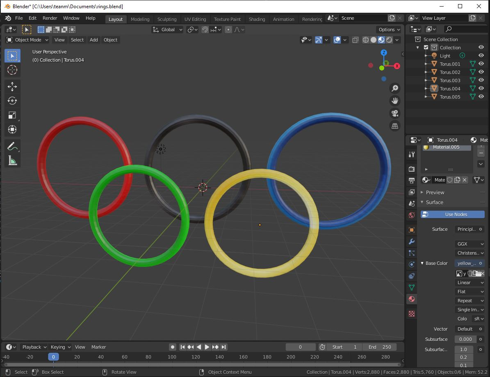

The main stadium of an Olympics is the most integral location as it hosts the opening and closing ceremonies, the lighting of the touch and the most popular events [19]. The architecture and design choices of these stadiums ensure athletes can compete in optimal circumstances and thousands of spectators can experience these feats [18]. This project will highlight the ingenuity of these stadiums by offering the opportunity to view its design in detail as a competitor on its athletic track. The end goal is to have a model of an athlete posed as running able to move along an athletic track surrounded by stadium seating and accompanied by props.

In addition to the report a presentation was given providing an overview.

# MEGA RACER

## TIER 1

### 1.1 Scale the terrain

### 1.2 Set the virtual camera

### 1.3 Replace with a racer model

### 1.4 Add terrain texture

### 1.5 Lighting from the sun

## TIER 2

### 2.1 Improve terrain texture

### 2.2 Add fog

### 2.3 Add props

# OLYMPICS

### Athlete

### Props

  
   

### Map

### Terrain Textures

